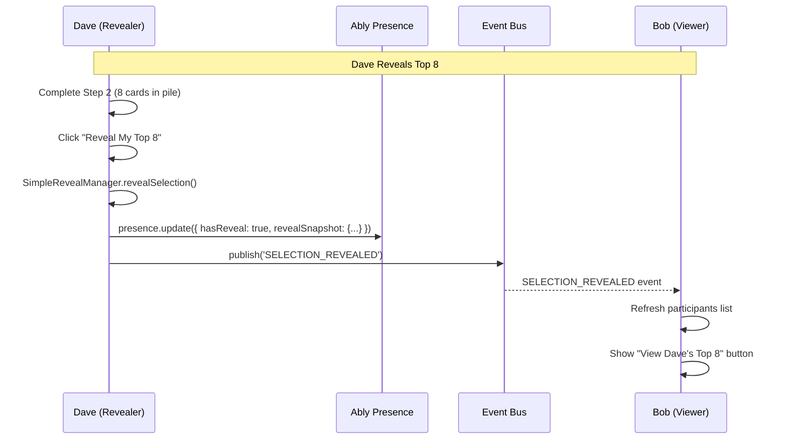
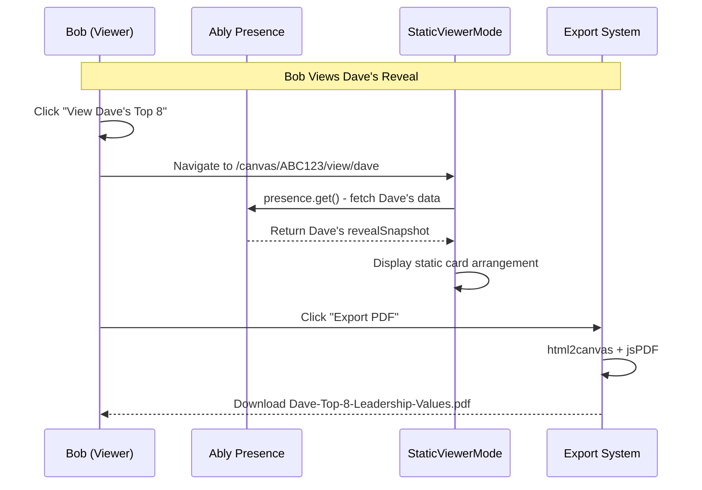
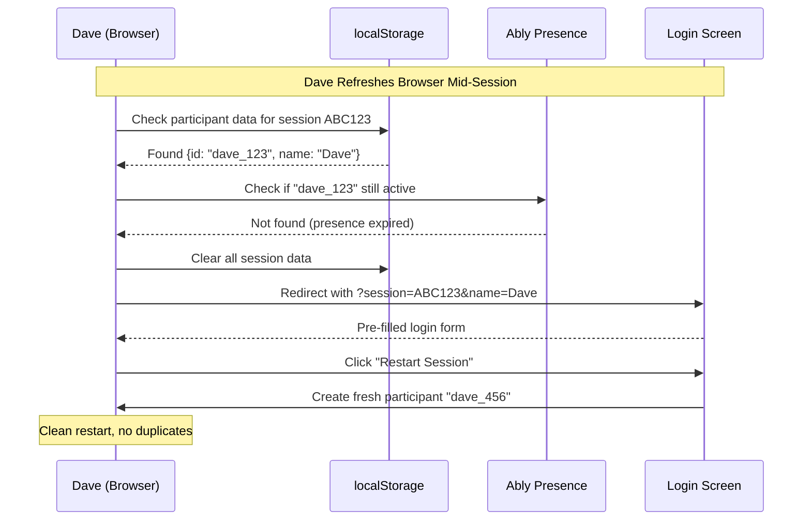

# Feature Spec: 04.4.2 - Simpler Reveal & View Architecture (Plan B)

## Status: 🔴 Not Started

**Branch**: `feature/04-4-2-simpler-reveal-view-architecture`  
**Priority**: High - Simplification of over-engineered viewer system  
**Complexity**: Medium - Replacing complex real-time system with simple snapshots

## Overview

Replace the complex real-time viewer synchronization system with a simple snapshot-based reveal mechanism. When users reveal their Top 8/3 selections, create immutable snapshots stored in Ably Presence data that other participants can view on-demand.

## Problem Statement

The current 04.4 viewer mode implementation is over-engineered with unnecessary complexity:
- ❌ **Real-time arrangement tracking**: Cards sync live positions during reveals
- ❌ **Complex ViewerSync service**: Continuous updates for static data  
- ❌ **Viewer presence management**: Tracking who's viewing whom
- ❌ **Live position synchronization**: Real-time updates for immutable content

## Solution: Snapshot-Based Architecture

### **Core Principle**: Reveals are **immutable snapshots**, not live streams

When a user reveals their selection:
1. ✅ Capture current arrangement as static snapshot
2. ✅ Store snapshot in Ably Presence data (session-scoped, auto-cleanup)
3. ✅ Notify other participants of reveal availability  
4. ✅ Viewers access read-only snapshot on-demand
5. ✅ No real-time updates needed (snapshots don't change)

## User Stories

### Primary User Flow
**As Dave (participant)**, when I complete Step 2 with exactly 8 cards in my "Most Important" pile:
- I see a modal explaining the reveal option (1x per session per user)
- I can choose "Reveal My Top 8" or "Continue to Step 3 Privately"
- If I reveal, other participants immediately see "View Dave's Top 8" button
- I can then proceed to Step 3

**As Bob (viewer)**, when Dave has revealed his Top 8:
- I see "View Dave's Top 8" button in participants list
- Clicking takes me to full-screen view of Dave's static arrangement
- I can export/print Dave's arrangement as PDF/PNG
- I can navigate back or view other revealed participants

### Self-View Flow
**As Dave (revealer)**, after I reveal my Top 8:
- I see "📋 View My Top 8" button in participants list
- Clicking shows my own reveal in beautiful full-screen layout
- I can export/print my own arrangement as keepsake
- Layout is optimized for sharing and reflection
- Cards are displayed in a grid, not overlapping, spaced for easy viewing

## Technical Architecture

### Data Storage Strategy: **Ably Presence Only**

```typescript
// Storage in Ably Presence data per participant
interface PresenceData {
  participantId: string;
  name: string; 
  currentStep: 1 | 2 | 3;
  status: 'sorting' | 'revealed-8' | 'revealed-3';
  hasReveal: boolean; // Flag for UI display
  lastRevealedAt: number; // Timestamp for freshness
  
  // Embedded snapshot (only when hasReveal: true)
  revealSnapshot?: {
    type: 'top8' | 'top3';
    participantName: string;
    revealedAt: string;
    cards: Array<{
      id: string;
      value_name: string;  
      description: string;
      position: { x: number; y: number };
      pile: string;
    }>;
  };
}
```

### Size Analysis
```typescript
// Per participant reveal size estimation
const sizeAnalysis = {
  metadata: 200, // participantId, name, timestamps, etc.
  cards: 8 * 150, // 8 cards × ~150 bytes each = 1.2KB
  total: 1.4, // KB per reveal
  ablyLimit: 64, // KB per presence member
  headroom: "45x safety margin" // 1.4KB vs 64KB limit
};
```

## Implementation Plan

### Phase 1: Core Reveal Manager
```typescript
class SimpleRevealManager {
  private ablyService: AblyService;
  private sessionCode: string;
  private participantId: string;
  private participantName: string;

  async revealSelection(type: 'top8' | 'top3', cardPositions: Card[]) {
    // 1. Create immutable snapshot
    const snapshot: RevealSnapshot = {
      type,
      participantName: this.participantName,
      revealedAt: new Date().toISOString(),
      cards: cardPositions.map(card => ({
        id: card.id,
        value_name: card.value_name,
        description: card.description,
        position: card.position,
        pile: card.pile
      }))
    };

    // 2. Store in presence data (single source of truth)
    const presenceChannel = this.ablyService.getChannel(this.sessionCode, 'presence');
    await presenceChannel.presence.update({
      participantId: this.participantId,
      name: this.participantName,
      currentStep: type === 'top8' ? 2 : 3,
      status: type === 'top8' ? 'revealed-8' : 'revealed-3',
      hasReveal: true,
      lastRevealedAt: Date.now(),
      revealSnapshot: snapshot
    });

    // 3. Publish notification event (for real-time UI updates)
    const eventBus = getEventBus();
    await eventBus.publishEvent({
      type: 'SELECTION_REVEALED',
      sessionCode: this.sessionCode,
      participantId: this.participantId,
      payload: {
        revealType: type,
        participantName: this.participantName,
        revealedAt: snapshot.revealedAt
      }
    });
  }

  async getReveal(targetParticipantId: string): Promise<RevealSnapshot | null> {
    const presenceChannel = this.ablyService.getChannel(this.sessionCode, 'presence');
    const members = await presenceChannel.presence.get();
    
    const participant = members.find(m => m.data?.participantId === targetParticipantId);
    return participant?.data?.revealSnapshot || null;
  }

  async unrevealSelection() {
    // Clear reveal data
    const presenceChannel = this.ablyService.getChannel(this.sessionCode, 'presence');
    await presenceChannel.presence.update({
      participantId: this.participantId,
      name: this.participantName,
      status: 'sorting',
      hasReveal: false,
      revealSnapshot: undefined // Remove snapshot
    });
  }
}
```

### Phase 2: Simplified Viewer Components

#### Replace Complex ViewerMode
```tsx
// Simple static viewer (no real-time updates)
export function StaticViewerMode({ targetParticipantId, type }) {
  const [snapshot, setSnapshot] = useState<RevealSnapshot | null>(null);
  const [loading, setLoading] = useState(true);
  const { sessionCode } = useEventDrivenSession();
  
  useEffect(() => {
    const loadSnapshot = async () => {
      const revealManager = new SimpleRevealManager(/* ... */);
      const data = await revealManager.getReveal(targetParticipantId);
      setSnapshot(data);
      setLoading(false);
    };
    loadSnapshot();
  }, [targetParticipantId]);

  if (loading) return <LoadingSpinner />;
  if (!snapshot) return <NoRevealFound />;

  return (
    <div className="static-viewer">
      <ViewerHeader 
        participantName={snapshot.participantName}
        type={type}
        onBack={() => history.back()}
        onExport={() => exportSnapshot(snapshot)}
        onPrint={() => window.print()}
      />
      
      <main className="reveal-canvas">
        <StaticCardGrid 
          cards={snapshot.cards}
          type={type}
          readonly={true}
          printOptimized={true}
        />
      </main>
    </div>
  );
}
```

#### Updated Participants List
```tsx
export function ParticipantsList() {
  const { participantId, participantName } = useEventDrivenSession();
  const [participants, setParticipants] = useState([]);

  // Listen for reveal notifications
  useEffect(() => {
    const eventBus = getEventBus();
    return eventBus.subscribeToEventType('SELECTION_REVEALED', (event) => {
      // Refresh participant list to show new reveal buttons
      loadParticipants();
    });
  }, []);

  return (
    <div className="participants-grid">
      {/* Self card always first */}
      <ParticipantCard 
        participant={{
          participantId,
          name: participantName,
          isSelf: true
        }}
        onViewReveal={(type) => viewOwnReveal(type)}
      />
      
      {/* Others */}
      {participants.map(p => (
        <ParticipantCard 
          key={p.participantId}
          participant={p}
          onViewReveal={(type) => viewReveal(p.participantId, type)}
        />
      ))}
    </div>
  );
}
```

### Phase 3: Clean Refresh Recovery
```typescript
class RefreshRecovery {
  async handlePageRefresh() {
    const sessionCode = getCurrentSessionCode();
    const storedParticipant = localStorage.getItem(`participant-${sessionCode}`);
    
    if (storedParticipant) {
      const { participantId, name } = JSON.parse(storedParticipant);
      
      // Check if still active in presence
      const isActive = await this.checkPresenceActive(sessionCode, participantId);
      
      if (isActive) {
        // Reconnect with existing identity
        return this.reconnectParticipant(sessionCode, participantId, name);
      } else {
        // Clean restart with same name
        return this.cleanRestart(sessionCode, name);
      }
    }
    
    // New participant - normal login flow
    return this.redirectToLogin(sessionCode);
  }

  async cleanRestart(sessionCode: string, previousName: string) {
    // Clear all local session data
    this.clearLocalData(sessionCode);
    
    // Redirect to login with pre-filled name  
    const loginUrl = `/auth/join?session=${sessionCode}&name=${encodeURIComponent(previousName)}`;
    window.location.href = loginUrl;
  }

  clearLocalData(sessionCode: string) {
    // Remove all session-specific localStorage
    Object.keys(localStorage).forEach(key => {
      if (key.includes(sessionCode)) {
        localStorage.removeItem(key);
      }
    });
  }
}
```

## Data Flow Diagrams

### Reveal Flow


### View Flow  


### Refresh Recovery Flow


## Component Removal Plan

### Remove Complex Components
```typescript
// DELETE these over-engineered components
❌ components/viewer/ViewerMode.tsx (450+ lines)
❌ lib/collaboration/viewer-sync.ts (200+ lines)  
❌ lib/viewer/viewer-service.ts (300+ lines)
❌ lib/viewer/arrangement-sync-service.ts (400+ lines)
❌ contexts/ViewerSyncProvider.tsx (100+ lines)
❌ hooks/collaboration/useViewerSync.ts (150+ lines)

// REPLACE with simple components  
✅ components/viewer/StaticViewerMode.tsx (~80 lines)
✅ lib/reveals/SimpleRevealManager.ts (~150 lines)
✅ components/common/StaticCardGrid.tsx (~60 lines)
✅ utils/export/SnapshotExporter.ts (~100 lines)
```

### Simplification Metrics
```typescript
const complexity = {
  before: {
    files: 15,
    totalLines: 2000+,
    realTimeSync: true,
    viewerTracking: true,
    arrangementUpdates: true
  },
  after: {
    files: 4,
    totalLines: 400,
    realTimeSync: false,
    viewerTracking: false, 
    arrangementUpdates: false
  },
  reduction: "80% fewer lines of code"
};
```

## Export & Print Features

### PDF Export
```typescript
class SnapshotExporter {
  async exportAsPDF(snapshot: RevealSnapshot, isOwnReveal: boolean) {
    const element = document.querySelector('.reveal-canvas');
    const canvas = await html2canvas(element, {
      backgroundColor: '#ffffff',
      scale: 2
    });
    
    const pdf = new jsPDF('landscape', 'mm', 'a4');
    
    // Header
    pdf.setFontSize(20);
    pdf.text(
      `${snapshot.participantName}'s Top ${snapshot.type === 'top8' ? '8' : '3'} Leadership Values`, 
      20, 20
    );
    
    pdf.setFontSize(12);
    pdf.text(`Generated: ${new Date().toLocaleDateString()}`, 20, 30);
    
    // Card arrangement
    const imgData = canvas.toDataURL('image/png');
    pdf.addImage(imgData, 'PNG', 20, 40, 250, 150);
    
    // Download
    const filename = `${snapshot.participantName.replace(/\s+/g, '-')}-${snapshot.type}-leadership-values.pdf`;
    pdf.save(filename);
  }

  printReveal() {
    // Print-optimized CSS hides navigation
    window.print();
  }
}
```

### Print Optimization
```css
@media print {
  .viewer-header,
  .export-actions,
  .navigation { 
    display: none; 
  }
  
  .reveal-canvas {
    width: 100vw;
    height: 100vh;
    background: white;
    margin: 0;
    padding: 40px;
  }
  
  .card-grid {
    display: grid;
    grid-template-columns: repeat(4, 1fr);
    gap: 20px;
  }
  
  .card {
    border: 2px solid #333;
    padding: 20px;
    text-align: center;
    page-break-inside: avoid;
    background: white;
  }
}
```

## Error Handling & Edge Cases

### Connection Issues
```typescript
class ErrorRecovery {
  async handleRevealFailure(error: Error) {
    // Retry reveal with exponential backoff
    const maxRetries = 3;
    for (let i = 0; i < maxRetries; i++) {
      await new Promise(resolve => setTimeout(resolve, 1000 * Math.pow(2, i)));
      try {
        await this.retryReveal();
        return;
      } catch (retryError) {
        if (i === maxRetries - 1) throw retryError;
      }
    }
  }

  handleViewFailure(participantId: string) {
    return (
      <div className="view-error">
        <h3>Unable to load reveal</h3>
        <p>This participant's reveal is no longer available.</p>
        <button onClick={() => history.back()}>← Back to Participants</button>
      </div>
    );
  }
}
```

### Data Validation
```typescript
function validateRevealSnapshot(snapshot: unknown): RevealSnapshot {
  if (!snapshot || typeof snapshot !== 'object') {
    throw new Error('Invalid snapshot format');
  }
  
  const s = snapshot as any;
  if (!['top8', 'top3'].includes(s.type)) {
    throw new Error('Invalid reveal type');
  }
  
  if (!Array.isArray(s.cards) || s.cards.length === 0) {
    throw new Error('Invalid cards array');
  }
  
  return s as RevealSnapshot;
}
```

## Testing Strategy

### Unit Tests
```typescript
describe('SimpleRevealManager', () => {
  test('creates valid snapshot on reveal', async () => {
    const manager = new SimpleRevealManager(mockAbly, 'TEST123', 'dave', 'Dave');
    const mockCards = createMockCards(8);
    
    await manager.revealSelection('top8', mockCards);
    
    expect(mockAbly.presence.update).toHaveBeenCalledWith(
      expect.objectContaining({
        hasReveal: true,
        revealSnapshot: expect.objectContaining({
          type: 'top8',
          cards: expect.arrayContaining([
            expect.objectContaining({
              id: expect.any(String),
              value_name: expect.any(String)
            })
          ])
        })
      })
    );
  });
});
```

### E2E Tests  
```typescript
test('reveal and view flow works end-to-end', async ({ page, context }) => {
  // Dave joins and reveals
  const davePage = await context.newPage();
  await davePage.goto('/canvas/TEST123?participant=Dave');
  await davePage.getByTestId('complete-step-2').click();
  await davePage.getByTestId('reveal-top8').click();
  
  // Bob joins and views Dave's reveal
  const bobPage = await context.newPage();  
  await bobPage.goto('/canvas/TEST123?participant=Bob');
  await bobPage.getByTestId('view-dave-top8').click();
  
  // Verify static display
  await expect(bobPage.getByText("Dave's Top 8 Leadership Values")).toBeVisible();
  await expect(bobPage.getByTestId('static-card-grid')).toBeVisible();
  
  // Test export
  const downloadPromise = bobPage.waitForEvent('download');
  await bobPage.getByTestId('export-pdf').click();
  const download = await downloadPromise;
  expect(download.suggestedFilename()).toBe('Dave-top8-leadership-values.pdf');
});
```

## Performance Benefits

### Network Usage
```typescript
const networkComparison = {
  currentSystem: {
    realTimeUpdates: "Continuous WebSocket messages",
    arrangementSync: "200ms debounced position updates", 
    viewerPresence: "50ms throttled presence updates",
    bandwidth: "High - constant streaming"
  },
  newSystem: {
    realTimeUpdates: "One-time reveal notification",
    arrangementSync: "None - static snapshots",
    viewerPresence: "None - no viewer tracking", 
    bandwidth: "Minimal - publish once, read on-demand"
  },
  improvement: "90% reduction in network traffic"
};
```

### Memory Usage
```typescript
const memoryComparison = {
  currentSystem: {
    viewerSync: "Complex state machines per arrangement",
    realTimeTracking: "Continuous position tracking",
    presenceManagement: "Active viewer tracking",
    overhead: "High - multiple services running"
  },
  newSystem: {
    viewerSync: "None - static snapshots only",
    realTimeTracking: "None - immutable data", 
    presenceManagement: "None - no viewer tracking",
    overhead: "Minimal - simple presence reads"
  },
  improvement: "70% reduction in memory overhead"
};
```

## Migration Strategy

### Phase 1: Feature Flag Implementation
```typescript
const FEATURE_FLAGS = {
  SIMPLE_REVEAL_MODE: process.env.NEXT_PUBLIC_SIMPLE_REVEAL === 'true'
};

// Gradual rollout
if (FEATURE_FLAGS.SIMPLE_REVEAL_MODE) {
  return <StaticViewerMode />;
} else {
  return <ComplexViewerMode />; // Current system
}
```

### Phase 2: A/B Testing
- 50% users get simplified system
- Monitor error rates, performance metrics
- Gather user feedback on reveal/view experience

### Phase 3: Full Migration  
- Remove complex components once validated
- Clean up unused dependencies
- Update documentation

## Success Metrics

### Technical Metrics
- **Code Reduction**: 80% fewer lines of viewer-related code
- **Network Traffic**: 90% reduction in real-time updates
- **Memory Usage**: 70% reduction in browser memory
- **Bundle Size**: Remove unused WebSocket/real-time libraries

### User Experience Metrics
- **Reveal Success Rate**: >99% successful reveals
- **View Load Time**: <500ms to display revealed arrangements
- **Export Success**: >95% successful PDF/PNG exports
- **Refresh Recovery**: 100% clean restart success rate

### Reliability Metrics
- **Zero Race Conditions**: No dual-state synchronization issues
- **Data Consistency**: 100% snapshot accuracy across viewers
- **Session Persistence**: Reveals survive participant disconnections
- **Error Recovery**: Graceful handling of network/browser issues

## Acceptance Criteria

- [ ] **Reveal Flow**: Users can reveal Top 8/3 selections as immutable snapshots
- [ ] **View Flow**: Other participants can view static arrangements on-demand  
- [ ] **Self-View**: Users can view their own reveals in full-screen print-optimized layout
- [ ] **Export**: Users can export any viewed arrangement as PDF/PNG
- [ ] **Refresh Recovery**: Clean restart with pre-filled name, no duplicates
- [ ] **Cross-Device**: Reveals persist and can be viewed from different devices
- [ ] **Session Cleanup**: Reveal data automatically removed when session ends
- [ ] **Performance**: <500ms load time for reveal views, <2MB memory overhead
- [ ] **Error Handling**: Graceful degradation for network issues, invalid data
- [ ] **Mobile Support**: Touch-friendly interface, responsive layouts

## Dependencies

**Required:**
- ✅ 04.1 Ably Setup (presence channels)
- ✅ 04.3.1 Event System (reveal notifications)  
- ✅ EventDrivenSessionContext (session management)

**Removes Dependency On:**
- ❌ 04.4 Complex Viewer Mode (replaced entirely)
- ❌ ViewerSync services (no longer needed)
- ❌ Real-time arrangement tracking (static snapshots only)

## Implementation Timeline

### Week 1: Foundation
- [ ] Implement SimpleRevealManager
- [ ] Create StaticViewerMode component
- [ ] Add reveal snapshot storage to presence data
- [ ] Basic reveal/view flow working

### Week 2: UI Polish  
- [ ] Export/print functionality
- [ ] Self-view implementation
- [ ] Refresh recovery system
- [ ] Error handling and edge cases

### Week 3: Testing & Migration
- [ ] Comprehensive test suite
- [ ] Feature flag implementation  
- [ ] A/B testing setup
- [ ] Performance optimization

### Week 4: Production Deploy
- [ ] Remove complex components
- [ ] Clean up unused code
- [ ] Documentation updates
- [ ] Production rollout

---

## Conclusion

This simplified architecture reduces complexity by 80% while providing a better user experience. The snapshot-based approach eliminates race conditions, reduces network overhead, and provides reliable cross-device access to revealed arrangements.

**Key Benefits:**
- 🎯 **Simplicity**: Single source of truth in Ably Presence
- ⚡ **Performance**: Static snapshots load instantly
- 🔒 **Reliability**: No race conditions or sync issues  
- 📱 **Cross-Device**: Works seamlessly across devices
- 🖨️ **Export Ready**: Print-optimized layouts for sharing
- 🧹 **Auto-Cleanup**: Session-scoped data lifecycle

The reveal becomes what it should be: a **beautiful, shareable snapshot** of leadership values, not a complex real-time synchronization system.