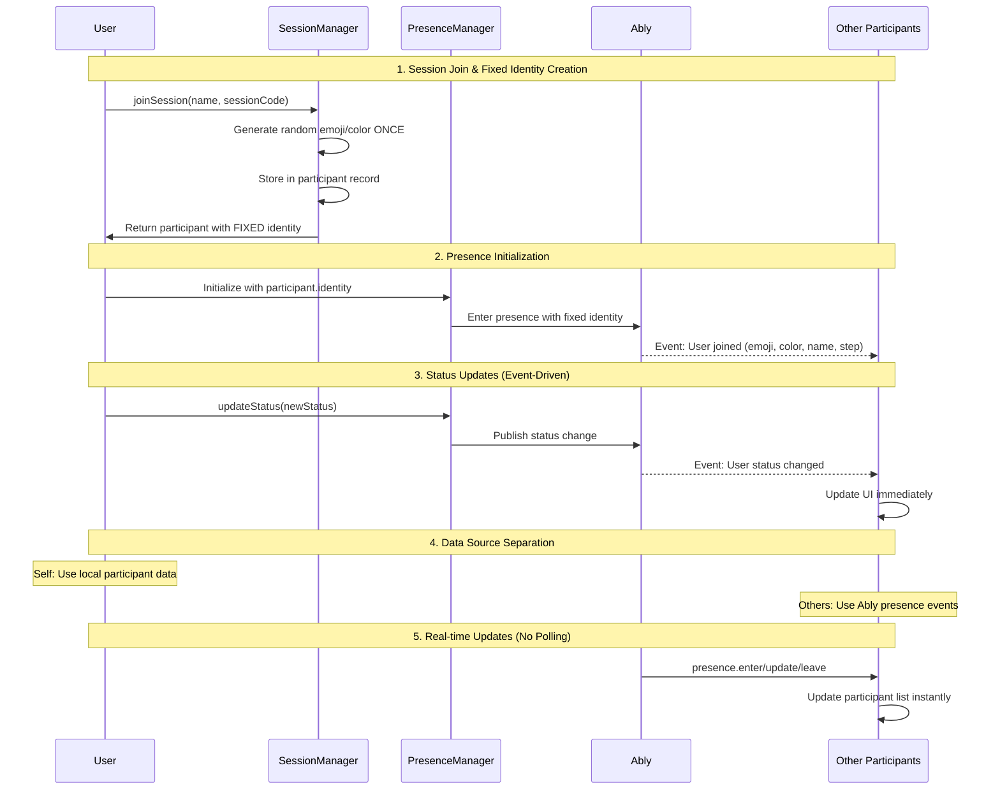

# 04.5.5 Participant State Consistency

**Status**: 🔴 Not Started  
**Priority**: Critical - Production Blocker  
**Estimated Effort**: 2-3 hours  

## Problem Statement

Current participant system has fundamental architecture flaws causing visual inconsistencies:

1. **Identity Flickering**: Participant emoji/color changes every 2 seconds (🍒 ↔ 🥑)
2. **Inconsistent Source of Truth**: Self vs others use different data sources
3. **Multiple Assignment Points**: Random identity generated in 2+ places simultaneously
4. **Polling-Based Updates**: 2-second polling causes delays and inconsistencies
5. **State Confusion**: Self sees local data, others see Ably data, causing desynchronization

### User Impact
- Confusing participant identification (emoji keeps changing)
- Poor real-time collaboration experience
- Unreliable presence indicators
- Step status inconsistencies between participants

## Solution Architecture

### Core Principle: Single Source of Truth
- **Self identity**: Assigned ONCE at session join, stored locally, published to Ably
- **Others' identity**: Received via Ably presence events only
- **One-way flow**: Self → Ably → Others (no bidirectional confusion)
- **Event-driven**: Replace polling with real-time Ably subscriptions

### Data Flow

## Implementation Plan

### Phase 1: Fix Identity Assignment (30 min)
- [ ] **Session Manager**: Make emoji/color assignment happen ONLY in `joinSession()`
- [ ] **Remove Duplicate Assignment**: Delete random generation from `usePresence.ts`
- [ ] **Pass Identity Down**: Thread participant identity from session → canvas → presence

### Phase 2: Event-Driven Architecture (45 min)
- [ ] **Remove Polling**: Replace 2-second interval with event subscriptions
- [ ] **Presence Events**: Subscribe to `presence.enter/update/leave` in PresenceManager
- [ ] **Real-time Updates**: Propagate presence changes immediately to UI

### Phase 3: Separate Self vs Others (30 min)
- [ ] **Self Data Source**: Use local `currentUser` for self display
- [ ] **Others Data Source**: Use Ably `participants` map for others
- [ ] **Component Updates**: Fix ParticipantList to distinguish data sources

### Phase 4: Testing & Validation (30 min)
- [ ] **Manual Testing**: Verify emoji/color consistency across multiple participants
- [ ] **Real-time Validation**: Test immediate status/step updates
- [ ] **Edge Cases**: Test network disconnection, reconnection scenarios

## Files to Modify

### Core Architecture Files
- `/lib/session/session-manager.ts` - Single identity assignment point
- `/hooks/collaboration/usePresence.ts` - Remove random assignment, add event subscriptions
- `/lib/presence/presence-manager.ts` - Add presence event subscription methods

### Integration Files  
- `/app/canvas/page.tsx` - Pass participant identity to presence system
- `/components/collaboration/ParticipantList.tsx` - Separate self vs others data

### Test Files
- Update relevant unit tests to reflect single assignment point
- Add integration tests for real-time presence events

## Success Criteria

### Functional Requirements
- [ ] **Identity Consistency**: Emoji/color never changes for a participant during session
- [ ] **Real-time Updates**: Status/step changes appear instantly for all participants
- [ ] **Self vs Others**: Clear data source separation with no cross-contamination
- [ ] **Event-Driven**: Zero polling, all updates via Ably presence events

### Technical Requirements
- [ ] **Single Assignment**: Emoji/color generated exactly once in `SessionManager.joinSession()`
- [ ] **Immutable Identity**: Participant identity fixed for session duration
- [ ] **Event Subscriptions**: All presence updates via `presence.enter/update/leave`
- [ ] **Data Isolation**: Self from local state, others from Ably events

### User Experience
- [ ] **Visual Consistency**: Same emoji/color visible to all participants
- [ ] **Instant Updates**: No 2-second delays in status changes
- [ ] **Reliable Presence**: Accurate participant count and step indicators

## Testing Strategy

### Manual Testing
1. Open 2+ browser tabs with different participants
2. Verify emoji/color consistency across all tabs
3. Change step/status in one tab, verify instant updates in others
4. Test network disconnection/reconnection scenarios

### Automated Testing
- Unit tests for single identity assignment
- Integration tests for presence event flow
- E2E tests for multi-participant consistency

## Implementation Notes

### Key Architectural Changes
- **SessionManager becomes identity authority**: Only place emoji/color assigned
- **PresenceManager becomes event broadcaster**: Publishes changes, doesn't create identity  
- **usePresence becomes event subscriber**: Receives others' changes, publishes self changes
- **Components use dual data sources**: Self from local, others from events

### Migration Strategy
1. Fix identity assignment first (prevents new flickering)
2. Add event subscriptions alongside polling initially
3. Remove polling once events confirmed working
4. Update components to use correct data sources

## Dependencies
- Ably presence events properly configured
- Session-scoped participant identity system working
- React state management for immediate UI updates

## Risks & Mitigations
- **Network issues**: Implement presence heartbeat for connection health
- **Event ordering**: Use timestamp-based conflict resolution
- **State desync**: Add periodic reconciliation (much less frequent than current polling)

---

**Next Steps**: Start with Phase 1 (Fix Identity Assignment) to immediately stop the emoji flickering issue.